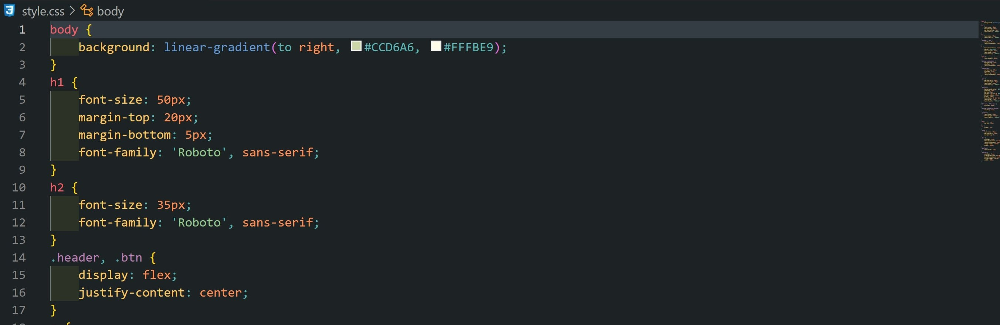

<a name="readme-top"></a>
<div>
  <h1 align="center">Hi there, I'm <a href="https://www.instagram.com/prostofil_ka/" target="_blank">Anna</a></h1>
</div>
<br />
<!-- PROJECT LOGO -->
<br />
<div align="center">
  <a href="https://github.com/Nyushaf/What-to-do-in-Vancouver.git">
    
  </a>

  <h3 align="center">What to do in Vancouver</h3>

  <p align="center">
    An interesting app in the form of a fortune play. 
       <br />
    <a href="https://github.com/Nyushaf/What-to-do-in-Vancouver"><strong>Explore the docs »</strong></a>
    <br />
    <br />
    ·
    <a href="https://what-to-do-in-vancouver.netlify.app">View Demo</a>
    ·
  </p>
  <a name="readme-top"></a>
</div>


<!-- TABLE OF CONTENTS -->
<details>
  <summary>Table of Contents</summary>
  <ol>
    <li>
      <a href="#about-the-project">About The Project</a>
      <ul>
        <li><a href="#built-with">Built With</a></li>
      </ul>
    </li>
    <li>
      <a href="#getting-started">Getting Started</a>
      <ul>
        <li><a href="#installation">Installation</a></li>
      </ul>
    </li>
    <li><a href="#usage">Usage</a></li>
    <li><a href="#contact">Contact</a></li>
  </ol>
</details>

<!-- ABOUT THE PROJECT -->
## About The Project


This project is created in the form of a game with luck and allows the user, with the help of answers to simple questions, to pick up events in the city of Vancouver.  
Depending on the user's responses, the application produces a suitable result.

  


<p align="right">(<a href="#readme-top">back to top</a>)</p>

### Built With

The following tools were used to create this project:

* 
* 
* 

<p align="right">(<a href="#readme-top">back to top</a>)</p>

<!-- GETTING STARTED -->
## Getting Started

To get a local copy up and running follow these simple example steps.

### Installation

1. Copy link: <strong>https://github.com/Nyushaf/What-to-do-in-Vancouver.git</strong>
2. Clone the repo 
   ```sh
   git clone https://github.com/Nyushaf/What-to-do-in-Vancouver.git
   ```
3. Change parametrs CSS
   
<br />
  
<p align="right">(<a href="#readme-top">back to top</a>)</p>


<!-- USAGE EXAMPLES -->
## Usage

Just choose the appropriate answer.


<p align="right">(<a href="#readme-top">back to top</a>)</p>

<!-- CONTACT -->
## Contact

Anna Filina - [linkedin](https://www.linkedin.com/in/anyuta-filina-40a131265/) - nyushaf@gmail.com

Project Link: [https://github.com/Nyushaf/What-to-do-in-Vancouver.git](https://github.com/Nyushaf/What-to-do-in-Vancouver.git)

<p align="right">(<a href="#readme-top">back to top</a>)</p>
